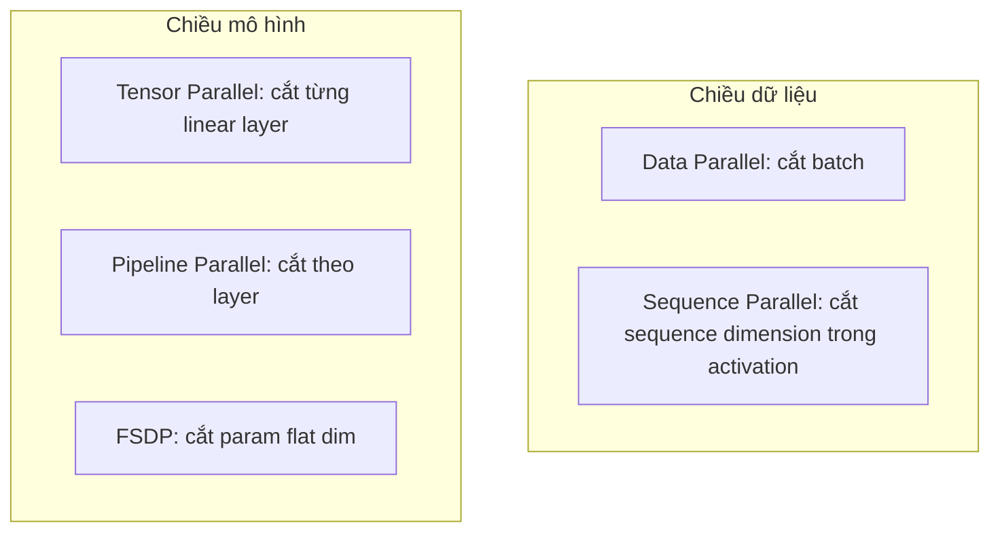

# Bốn loại Parallelism trong training mô hình lớn

Có bốn loại parallelism cốt lõi: Data Parallel, Tensor Parallel, Pipeline Parallel, và Fully Sharded Data Parallel. Sequence Parallel là một biến thể bổ trợ. Mỗi loại trả lời một câu hỏi khác nhau về việc “cắt cái gì”. Hiểu rõ bốn cái này sẽ cho bạn từ vựng đầy đủ để đọc bất kỳ paper training nào.

## Trục “cắt cái gì”

Một mô hình neural network có thể được nghĩ như tích hai chiều: chiều dữ liệu (batch và sequence) và chiều mô hình (params và layers). Mỗi loại parallelism là một cách chọn cắt một trong các trục đó.

## Data Parallel, DP

Ý tưởng cốt lõi: mỗi GPU giữ một bản sao đầy đủ của model. Batch được chia cho các GPU. Mỗi GPU forward và backward độc lập trên phần batch của nó. Sau backward, gradient được all-reduce qua các GPU để mọi bản sao có cùng gradient.

DP giải quyết vấn đề: throughput. Nó tăng batch effective theo số GPU. Nó **không** giảm bộ nhớ một GPU. Mỗi GPU vẫn giữ toàn bộ param, grad, opt state.

Với mô hình 3.5B trên GPU 24 GB, DP không cứu được. Vì 35 GB của param+opt vẫn nằm nguyên trên mỗi GPU.

DP đáng dùng khi mô hình đã vừa một GPU nhưng bạn muốn train nhanh hơn. Đây là sweet spot của các mô hình nhỏ tới trung bình.

## Tensor Parallel, TP

Ý tưởng cốt lõi: lấy một linear layer $Y = XW$, shard ma trận trọng số $W$ giữa các GPU. Mỗi GPU chỉ giữ một phần của $W$. Khi forward, ta điều phối các collective operation (all-reduce, all-gather) để kết quả tương đương với phép tính trên một GPU.

TP giải quyết vấn đề: bộ nhớ của param/grad/opt state cho **từng layer**. Một linear $8192 \times 8192$ với TP=4 chỉ còn $8192 \times 2048$ trên mỗi GPU.

Cost của TP là communication. Mỗi forward và backward của linear bị shard cần ít nhất một collective. Communication cost scale với hidden dim, không scale với batch. Nên TP chỉ kinh tế khi communication intra-node với NVLink, không tốt qua mạng inter-node thông thường.

Đây là chủ đề chính của chuỗi bài giảng. Phần 1 sẽ derive đầy đủ. Hãy giữ ý ở mức trực giác cho đến đó.

## Pipeline Parallel, PP

Ý tưởng cốt lõi: chia model thành các stage theo layer. GPU 0 chạy layer 1-8, GPU 1 chạy layer 9-16. Activation đi qua pipe giữa các GPU theo thứ tự forward, gradient đi ngược lại trong backward.

PP giải quyết vấn đề: bộ nhớ tổng. Mỗi GPU chỉ giữ param/grad/opt state cho một subset layer.

Vấn đề lớn nhất của PP là **bubble**. Trong khi GPU 0 đang chạy forward batch $t$ trên layer 1-8, GPU 1 đang rảnh chờ. Để giảm bubble, ta dùng micro-batching: chia batch thành nhiều micro-batch nhỏ rồi xen kẽ chúng qua pipe (interleaved hoặc 1F1B schedule).

PP đáng dùng khi mô hình quá lớn cho cả TP. Mô hình hàng trăm tỷ param thường dùng kết hợp TP và PP.

## Fully Sharded Data Parallel, FSDP

FSDP là phiên bản tinh tế của DP. Ý tưởng: thay vì replicate full model, mỗi GPU chỉ giữ **một phần** của param, grad, và opt state. Khi forward một layer, GPU all-gather đủ param để tính, rồi giải phóng. Backward tương tự.

FSDP giải quyết vấn đề: bộ nhớ param/grad/opt state ở quy mô toàn model, không chỉ một layer. Trong DP truyền thống, mọi GPU đều giữ 35 GB. Trong FSDP với 4 GPU, mỗi GPU chỉ giữ 35/4 = 8.75 GB lúc rảnh. Khi tính layer cụ thể, GPU all-gather đầy đủ param của layer đó về, dùng xong giải phóng.

FSDP và TP không loại trừ nhau. Trong 2D parallelism, ta dùng cả hai: TP cắt từng linear, FSDP shard phần còn lại theo dimension data. Toy `02_large_language_model/parallelism.py` chính là pattern này.

## Sequence Parallel, SP

SP không phải parallelism độc lập. Nó là biến thể bổ trợ cho TP. Ý tưởng: với các thao tác **không có ma trận trọng số lớn** như LayerNorm/RMSNorm và Dropout, vẫn shard activation theo chiều sequence để tiết kiệm activation memory.

Trong code TP đời đầu, LayerNorm được replicate trên mọi rank TP. SP shard nó theo sequence dim, giúp giảm activation. SP thường đi đôi với TP, không đứng một mình.

Trong toy của chúng ta, `SequenceParallel()` xuất hiện ở `norm`, `attention_norm`, `ffn_norm`. Phần 6 sẽ làm rõ.

## So sánh nhanh

| Loại | Cắt cái gì | Giảm gì | Tăng gì |
|---|---|---|---|
| DP | Batch | Không gì cho memory một GPU | Throughput |
| TP | Linear layer (param dim) | Param/grad/opt per-layer | Communication intra-node |
| PP | Theo layer | Total param/grad/opt | Bubble và scheduling complexity |
| FSDP | Param flat dim | Param/grad/opt toàn model | Communication mỗi forward/backward |
| SP | Sequence dim trong activation | Activation memory | Một số reshape và collective |

## Bao giờ kết hợp

Trong thực tế, không ai dùng một loại đơn lẻ cho mô hình thật. Kết hợp phổ biến:

**TP intra-node + FSDP inter-node**. TP=8 trong một node có NVLink, FSDP qua các node. Toy của chúng ta là phiên bản nhỏ hơn: TP=2 và FSDP=2 trong 4 GPU cùng node.

**TP + PP**. Cho mô hình hàng trăm tỷ param. TP trong một stage, PP giữa các stage.

**3D Parallel (TP + PP + DP/FSDP)**. Cho mô hình nghìn tỷ param. Megatron-Turing NLG, GPT-3 scale.

## Bài học chính

Tensor Parallelism là một mảnh ghép trong bài toán lớn hơn. Trước khi học chi tiết TP, hãy giữ trực giác này: TP cắt **chiều mô hình bên trong từng linear**. Nó đối ngẫu với DP (cắt batch) và bổ sung cho FSDP (cắt param toàn model theo flat dim).

Chương kế tiếp sẽ trả lời câu hỏi: khi nào TP là lựa chọn đúng, khi nào nó tạo nhiều overhead hơn lợi ích.
