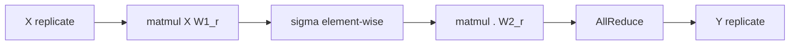
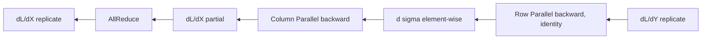

# Megatron MLP pattern, Column-then-Row

Một MLP hai tầng trong Transformer kinh điển có dạng:

$$
Y = \sigma(X W_1) W_2
$$

với $X \in \mathbb{R}^{B \times K}$, $W_1 \in \mathbb{R}^{K \times H}$, $W_2 \in \mathbb{R}^{H \times K}$, và $\sigma$ là một activation element-wise như GELU hoặc ReLU. Trong Transformer hiện đại, hidden dim $H$ thường gấp 4 lần $K$, nên hai tầng này chiếm phần lớn FLOPs và bộ nhớ trong block.

Câu hỏi đặt ra trong Phần 3: nếu $W_1$ và $W_2$ không vừa trong một GPU, ta shard chúng ra sao để vẫn tính được $Y$ đúng, với chi phí giao tiếp nhỏ nhất.

## Lựa chọn ngây thơ và vì sao nó dở

Ta có hai cách shard mỗi tầng linear (Column hay Row), nên về nguyên tắc có bốn tổ hợp cho cặp $(W_1, W_2)$: Col-Col, Col-Row, Row-Col, Row-Row. Đếm số collective trong forward cho mỗi tổ hợp sẽ trả lời tại sao chỉ một cái sống sót.

Phương án **Row-Row**. Tầng đầu $X W_1$ với $W_1$ shard hàng. Để dùng pattern này, ta cần $X$ đã shard cột. Nhưng input MLP đến từ kết quả của block trước (sau residual), vốn là tensor replicate. Buộc replicate input thành shard cột tốn một scatter, hoặc tốn bộ nhớ giữ thêm bản shard. Tệ hơn, sau tầng đầu ta được tensor partial, phải all-reduce. Rồi tầng hai lại cần input shard cột, lại scatter. Không hợp lý.

Phương án **Col-Col**. Tầng đầu $X W_1$ với $W_1$ shard cột. Đầu ra shard cột. Tầng hai $\sigma(\cdot) W_2$ với $W_2$ cũng shard cột thì cần input replicate. Buộc gom shard về replicate là một all-gather. Sau tầng hai output lại shard, ta phải all-gather thêm lần nữa nếu downstream cần replicate. Hai all-gather là quá dư.

Phương án **Row-Col**. Tệ hơn: cần scatter input vào tầng một, all-reduce ở giữa, all-gather ở cuối. Bị loại ngay.

Phương án **Col-Row**. Tầng đầu $W_1$ shard cột, đầu ra shard. Tầng hai $W_2$ shard hàng, input shard hàng khớp luôn với output shard cột của tầng một. Forward chỉ tốn đúng một all-reduce ở cuối. Đây là phương án tối ưu.

Phép đếm này không phải mẹo của Megatron, đó là sự thật toán học: trong một chuỗi hai linear, đặt Column trước Row là cách duy nhất khử được mọi collective ở giữa.

## Pattern chính thức

Megatron MLP pattern phát biểu thế này.

Cho MLP $Y = \sigma(X W_1) W_2$ chạy trên TP group có $P$ rank. Đặt:

- $W_1 = [W_1^{(0)} \mid W_1^{(1)} \mid \dots \mid W_1^{(P-1)}]$, shard theo cột, mỗi rank $r$ giữ $W_1^{(r)} \in \mathbb{R}^{K \times H/P}$.
- $W_2 = [W_2^{(0)\top} \mid W_2^{(1)\top} \mid \dots \mid W_2^{(P-1)\top}]^\top$, shard theo hàng, mỗi rank $r$ giữ $W_2^{(r)} \in \mathbb{R}^{H/P \times K}$.

Forward trên rank $r$:

$$
H^{(r)} = \sigma\left( X \, W_1^{(r)} \right) \in \mathbb{R}^{B \times H/P}
$$

$$
Y^{(r)} = H^{(r)} \, W_2^{(r)} \in \mathbb{R}^{B \times K}, \quad Y = \mathrm{AllReduce}\left( Y^{(0)}, \dots, Y^{(P-1)} \right)
$$

Bài tập một dòng dành cho bạn: thay $\sigma$ bằng identity và viết lại derivation, bạn sẽ thấy đẳng thức $\sum_r X W_1^{(r)} W_2^{(r)} = X W_1 W_2$ chính là khai triển nhân khối ma trận. Activation $\sigma$ là element-wise nên không phá vỡ tính shard cột.

## Vì sao activation không phá pattern

Đây là điểm mà người mới hay nhầm. Activation $\sigma$ là element-wise, nghĩa là $\sigma(a)_{ij} = \sigma(a_{ij})$ chỉ phụ thuộc vào phần tử tại vị trí $(i, j)$. Khi tensor $H = X W_1$ bị shard cột thành $H^{(r)}$, mỗi phần tử của $H^{(r)}$ chỉ là một subset cột của $H$ đầy đủ, và $\sigma$ trên $H^{(r)}$ trả về đúng subset tương ứng của $\sigma(H)$. Không cần gom rồi mới activate. Tóm gọn: activation element-wise commute với phép shard cột.

Nếu activation **không** element-wise, ví dụ một softmax theo chiều hidden, pattern này hỏng ngay. May mắn là MLP của Transformer dùng GELU, ReLU, SwiGLU, đều element-wise.

## Forward collective: chỉ một all-reduce

Đếm lại một cách tỉ mỉ:

- Input $X$ đã ở dạng replicate. Tầng đầu không cần collective.
- Output tầng đầu $H^{(r)}$ shard cột. Activation $\sigma$ không cần collective.
- Tầng hai dùng $W_2$ shard hàng. Input của Row Parallel phải shard cột, đúng như $H^{(r)}$. Không cần collective ở giữa.
- Output cuối là partial sum (xem chương Collective Operations Phần 1). Cần đúng một all-reduce để có $Y$ replicate.

Tổng cộng: **một all-reduce** trên tensor shape $(B, K)$. Đó là chi phí không thể giảm thêm nữa cho MLP TP, vì kết quả $Y$ phải replicate trên mọi rank để feed sang attention block kế tiếp.

## Backward collective: cũng chỉ một all-reduce

Quy tắc đối ngẫu từ Phần 1 nói: forward AllReduce $\Leftrightarrow$ backward Identity, và forward Identity $\Leftrightarrow$ backward AllReduce.

Phân tích từng tầng theo chiều ngược:

- Backward qua all-reduce cuối: identity, $\partial L / \partial Y^{(r)} = \partial L / \partial Y$ với mọi $r$.
- Backward qua Row Parallel ($W_2$): gradient với input $H^{(r)}$ là $\partial L / \partial H^{(r)} = (\partial L / \partial Y) (W_2^{(r)})^\top$. Vì $\partial L / \partial Y$ replicate, mỗi rank tính độc lập gradient với $H^{(r)}$ tương ứng (shard cột). Không collective.
- Backward qua activation: element-wise, không collective.
- Backward qua Column Parallel ($W_1$): gradient với input $X$ là $\partial L / \partial X = \sum_r (\partial L / \partial H^{(r)}) (W_1^{(r)})^\top$. Đây là tổng các đóng góp partial từ mỗi rank. Cần một **all-reduce** trên gradient của $X$.

Như vậy backward cũng chỉ thêm đúng một all-reduce trên tensor shape $(B, K)$. Tổng cộng forward + backward = hai all-reduce trên $(B, K)$. Đây là chi phí giao tiếp cho mỗi MLP block trong mỗi step training.

## Bộ nhớ tham số

Đếm thẳng:

- $W_1$ shard cột thành $P$ phần, mỗi rank giữ $K \times H / P$ tham số.
- $W_2$ shard hàng thành $P$ phần, mỗi rank giữ $H / P \times K$ tham số.

Tổng tham số mỗi rank: $2 K H / P$. So với baseline đơn lẻ $2 K H$, ta cần $P$ lần ít bộ nhớ tham số trên mỗi rank. Tương tự cho optimizer state (AdamW có hai moment, gấp 2 lần tham số), tổng tiết kiệm là đáng kể.

## Bộ nhớ activation

Forward tạo ra activation $H^{(r)}$ shape $(B, H/P)$. Nếu không có TP, ta phải lưu activation shape $(B, H)$. Vậy activation cũng được chia $P$ phần. Đây là một lợi ích thường bị bỏ quên: TP giúp giảm cả activation memory, không chỉ parameter memory.

Để giảm thêm activation memory, ta sẽ áp dụng activation checkpointing (chương Performance, Phần 9). Nhưng riêng TP đã giảm $P$ lần.

## Quy tắc lập kế hoạch cho hai linear liền kề

Đây là rút gọn để ghi nhớ. Khi bạn gặp một chuỗi hai linear $Y = X W_1 W_2$ (có hoặc không activation ở giữa, miễn là element-wise), quy tắc đặt placement là:

| Linear  | Placement | Input  | Output           |
|---------|-----------|--------|------------------|
| $W_1$   | Column    | Replicate | Shard cuối |
| $W_2$   | Row       | Shard cuối | Replicate (sau AllReduce) |

Quy tắc này có thể tổng quát hóa thành luật: nếu input cần replicate và output cần replicate, hãy mở bằng Column rồi đóng bằng Row, đặt mọi linear ở giữa theo cách giữ shard không đổi. Phần SwiGLU ở chương tiếp theo chỉ là một ví dụ tinh tế của luật này, khi ta có hai linear "mở" song song trước khi đóng bằng Row.

Pattern Column-then-Row là viên gạch nền. Chương sau ta thêm một viên gạch nữa: trường hợp SwiGLU với ba ma trận.
