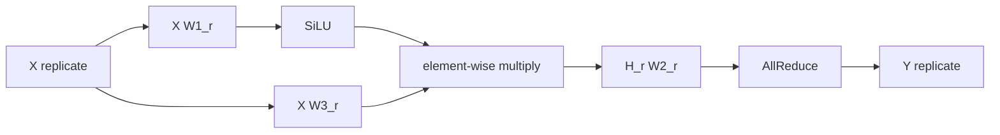

# SwiGLU và biến thể ba linear

Llama, Mistral, Qwen, và phần lớn LLM mở hiện đại không dùng MLP cổ điển $\sigma(X W_1) W_2$. Thay vào đó họ dùng SwiGLU, một biến thể của Gated Linear Unit. SwiGLU có ba ma trận trọng số thay vì hai, và lúc đầu pattern này nhìn có vẻ lệch với luật Column-then-Row ta vừa học. Ở chương này ta sẽ chỉ ra rằng SwiGLU vẫn tuân theo cùng nguyên tắc, chỉ cần một quan sát bổ sung về element-wise multiply.

## Công thức SwiGLU

SwiGLU MLP có dạng:

$$
Y = \big( \mathrm{SiLU}(X W_1) \odot (X W_3) \big) W_2
$$

với:

- $W_1, W_3 \in \mathbb{R}^{K \times H}$, hai ma trận chiếu lên hidden dim.
- $W_2 \in \mathbb{R}^{H \times K}$, ma trận chiếu trở lại model dim.
- $\mathrm{SiLU}(a) = a \cdot \sigma(a)$ với $\sigma$ là sigmoid, là một activation element-wise.
- $\odot$ là Hadamard product (element-wise multiply).

Ba ma trận này được Llama đặt tên `w1`, `w2`, `w3` trong code. Chú ý: `w1` và `w3` là hai "ứng viên" song song, một bên qua activation, một bên không, rồi nhân element-wise. `w2` đóng output về model dim. Đây chính là kiến trúc trong `01_simple_model/train.py` và trong `02_large_language_model/model.py` (lớp `FeedForward`).

## Vì sao có nhánh "gate" thứ ba

Trực giác: trong MLP cổ điển, activation $\sigma(X W_1)$ là một hàm phi tuyến cố định. Tín hiệu nào "đi qua" là do $\sigma$ quyết định, ví dụ ReLU cho mọi giá trị âm bằng 0. Với GLU và SwiGLU, ta để cho **mô hình tự học** cổng đi qua đó. Nhánh $X W_3$ đóng vai trò "gate" được học, nhân element-wise vào tín hiệu $\mathrm{SiLU}(X W_1)$ cho phép mô hình bật/tắt từng kênh hidden một cách mềm.

Về biểu cảm, SwiGLU mạnh hơn MLP ReLU/GeLU với cùng số tham số (kết quả thực nghiệm trong các paper architecture của Noam Shazeer và team Llama). Cái giá là 50% nhiều tham số hơn (ba ma trận thay vì hai cùng kích thước hidden), nên cộng đồng thường giảm hidden dim từ $4K$ xuống $\approx 2.67 K$ để giữ tổng tham số tương đương.

## Pattern TP cho SwiGLU

Câu hỏi quan trọng: $W_1, W_2, W_3$ nên shard theo Column hay Row?

Quan sát đầu tiên: hai nhánh $X W_1$ và $X W_3$ giống hệt nhau về mặt kiểu shape (input replicate, ma trận $K \times H$). Hợp lý là dùng cùng kiểu Column cho cả hai. Nếu ta chọn Column cho cả $W_1$ và $W_3$, output của hai nhánh đều shard theo chiều $H$.

Quan sát thứ hai: SiLU là element-wise. Như đã thấy ở chương trước, element-wise activation commute với shard cột. Vậy $\mathrm{SiLU}(X W_1^{(r)})$ vẫn shard cột chuẩn.

Quan sát thứ ba (mới ở chương này): **element-wise multiply giữa hai tensor cùng shard cuối kiểu** vẫn cho kết quả shard cuối. Cụ thể, nếu $A$ và $B$ đều shard theo chiều cuối $H$ thành các phần $A^{(r)}, B^{(r)}$ thì:

$$
(A \odot B)^{(r)} = A^{(r)} \odot B^{(r)}
$$

vì element-wise multiply chỉ chạm vào các phần tử có cùng vị trí. Mỗi rank chỉ cần nhân phần local của mình. **Không cần collective**.

Đây chính là lý do tại sao SwiGLU vẫn tương thích với pattern Megatron. Ta có thể "chia tự nhiên" cả $W_1$ và $W_3$ theo Column, làm activation và gate trên mỗi rank độc lập, rồi đóng bằng Row Parallel cho $W_2$.

## Plan chính thức cho SwiGLU TP

| Linear | Placement | Input | Output |
|--------|-----------|-------|--------|
| $W_1$  | Column    | Replicate | Shard cuối |
| $W_3$  | Column    | Replicate | Shard cuối |
| (SiLU + element-wise multiply) | (không có linear) | Shard cuối | Shard cuối |
| $W_2$  | Row       | Shard cuối | Replicate (sau AllReduce) |

Forward trên rank $r$:

$$
G^{(r)} = X W_1^{(r)} \in \mathbb{R}^{B \times H/P}
$$

$$
U^{(r)} = X W_3^{(r)} \in \mathbb{R}^{B \times H/P}
$$

$$
H^{(r)} = \mathrm{SiLU}(G^{(r)}) \odot U^{(r)} \in \mathbb{R}^{B \times H/P}
$$

$$
Y^{(r)} = H^{(r)} W_2^{(r)} \in \mathbb{R}^{B \times K}, \qquad Y = \mathrm{AllReduce}_r(Y^{(r)})
$$

Đếm collective: vẫn đúng **một all-reduce duy nhất ở cuối forward**, giống hệt MLP hai linear. Backward cũng vẫn một all-reduce, giống chương trước. SwiGLU không làm tăng chi phí giao tiếp.



## Vì sao không thể đảo Column và Row cho $W_1, W_3$

Một câu hỏi tự nhiên: ta có thể shard $W_1$ Column và $W_3$ Row được không. Câu trả lời: được về mặt toán, nhưng ngay lập tức $X W_3$ sẽ là partial sum trên chiều hidden, không phải shard cột. Để nhân element-wise với $\mathrm{SiLU}(X W_1)$ (đang shard cột), ta phải all-reduce $X W_3$ trước, đặt thêm một collective không cần thiết. Tệ hơn nữa, output cuối cũng không còn phù hợp với Row Parallel cho $W_2$. Pattern hỏng.

Bài học: khi có nhiều nhánh song song hội tụ qua một phép element-wise, **tất cả các nhánh phải cùng placement ở điểm hội tụ**. Đây là quy tắc thứ hai sau "Column-then-Row".

## Sai lầm thường gặp khi cài SwiGLU TP

Sai lầm 1: shard $W_3$ theo Row vì "tiết kiệm bộ nhớ input". Sai. Bộ nhớ input đã được shard ngầm bởi Column trên $W_1$. Shard $W_3$ Row chỉ thêm collective vô ích.

Sai lầm 2: quên rằng cả $W_1$ và $W_3$ đều phải shard **cùng chiều cuối**. Nếu mỗi cái shard một chiều khác, element-wise multiply sẽ trả về kết quả sai (hoặc PyTorch trả lỗi vì DTensor không match placement).

Sai lầm 3: bỏ AllReduce ở cuối, tưởng rằng output đã replicate. Output sau $W_2$ Row là partial, bắt buộc all-reduce. Quên cái này thì gradient tính theo $Y$ replicate sẽ hoàn toàn sai. May mắn là `parallelize_module` tự lo việc này khi bạn đánh dấu `RowwiseParallel()`.

## Liên hệ tới code Llama

Trong `02_large_language_model/model.py`, lớp `FeedForward` cài đúng công thức trên:

```python
def forward(self, x):
    return self.w2(F.silu(self.w1(x)) * self.w3(x))
```

Trong `parallelism.py`, kế hoạch TP cho FFN là:

```python
"feed_forward.w1": ColwiseParallel(),
"feed_forward.w2": RowwiseParallel(output_layouts=Shard(1)),
"feed_forward.w3": ColwiseParallel(),
```

(Tham số `output_layouts=Shard(1)` ở `w2` liên quan đến Sequence Parallel ta sẽ giải thích ở Phần 6. Ở chương này, hãy coi nó tương đương với Row Parallel chuẩn.)

Bạn đã có đủ lý thuyết. Chương tiếp theo ta sẽ mở `01_simple_model/train.py` và đọc từng dòng, ánh xạ vào pattern Megatron + SwiGLU vừa derive.
