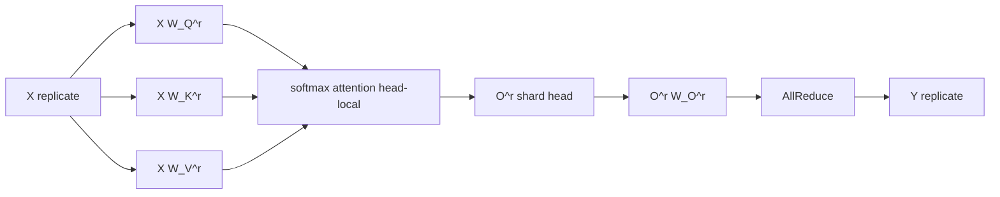

# Shard Multi-Head Attention theo head

Ở chương này ta phát biểu chính xác cách shard $W_Q, W_K, W_V, W_O$ trên một TP mesh có $P$ rank, derive forward và backward, và đếm chi phí giao tiếp.

## Setup

Cho input $X \in \mathbb{R}^{B \times K}$ replicate trên TP group. Một Multi-Head Attention với $H$ head, head dim $d_k = K / H$, có bốn ma trận trọng số:

$$
W_Q, W_K, W_V \in \mathbb{R}^{K \times K}, \qquad W_O \in \mathbb{R}^{K \times K}
$$

Mỗi ma trận có thể coi là ghép $H$ block cột (cho $W_Q, W_K, W_V$) hoặc $H$ block hàng (cho $W_O$), mỗi block tương ứng một head:

$$
W_Q = [W_Q^{(1)} \mid W_Q^{(2)} \mid \dots \mid W_Q^{(H)}], \qquad W_Q^{(h)} \in \mathbb{R}^{K \times d_k}
$$

$$
W_O = \begin{bmatrix} W_O^{(1)} \\ W_O^{(2)} \\ \vdots \\ W_O^{(H)} \end{bmatrix}, \qquad W_O^{(h)} \in \mathbb{R}^{d_k \times K}
$$

Nếu $P$ chia hết $H$, ta gán $H/P$ head cho mỗi rank. Rank $r$ giữ các head trong tập $\{r \cdot H/P + 1, \dots, (r+1) \cdot H/P\}$.

Trên rank $r$:

- $W_Q^{(r)} \in \mathbb{R}^{K \times d_k \cdot H/P}$, gồm các block cột của $H/P$ head được giao. Đây là một dạng Column Parallel.
- Tương tự cho $W_K^{(r)}, W_V^{(r)}$.
- $W_O^{(r)} \in \mathbb{R}^{d_k \cdot H/P \times K}$, gồm các block hàng. Đây là Row Parallel.

Vậy: $W_Q, W_K, W_V$ shard cột, $W_O$ shard hàng. Cùng pattern Megatron MLP, chỉ khác là Q/K/V là ba nhánh song song, giống vai trò của `w1, w3` trong SwiGLU (mở rộng từ hai nhánh thành ba).

## Forward derivation

Trên rank $r$, input $X$ đã replicate. Tính:

$$
Q^{(r)} = X W_Q^{(r)} \in \mathbb{R}^{B \times d_k \cdot H/P}
$$

$$
K^{(r)} = X W_K^{(r)} \in \mathbb{R}^{B \times d_k \cdot H/P}
$$

$$
V^{(r)} = X W_V^{(r)} \in \mathbb{R}^{B \times d_k \cdot H/P}
$$

Reshape thành dạng có chiều head:

$$
Q^{(r)} \to (B, H/P, d_k)
$$

(Tương tự $K^{(r)}, V^{(r)}$.) Mỗi rank giữ đúng $H/P$ head của $Q, K, V$.

Tính từng head độc lập:

$$
\mathrm{head}_h^{(r)} = \mathrm{softmax}\!\left( \frac{Q_h^{(r)} (K_h^{(r)})^\top}{\sqrt{d_k}} \right) V_h^{(r)} \in \mathbb{R}^{B \times d_k}, \quad h \in r\text{'s heads}
$$

Concat lại trên rank: ta được tensor $O^{(r)} \in \mathbb{R}^{B \times d_k \cdot H/P}$, là phần "head shard" của output trước $W_O$.

Đây chính là input mà $W_O$ Row Parallel mong đợi (input shard cuối). Tính:

$$
Y^{(r)} = O^{(r)} W_O^{(r)} \in \mathbb{R}^{B \times K}
$$

$Y^{(r)}$ là **partial** trên TP mesh: tổng của tất cả $Y^{(r)}$ trên các rank cho ra $Y$ đầy đủ (đây là khai triển nhân khối ma trận, đúng như Row Parallel ở Phần 1).

Cuối forward: một AllReduce trên tensor $(B, K)$ biến partial thành replicate.

## Vì sao softmax không phá pattern

Softmax được tính **trên chiều sequence**, không phải chiều head. Trong shape $(B, H, S, S)$ của scores tensor, softmax áp dụng trên trục $S$ cuối. Mỗi head có một bản softmax riêng, không cần giao tiếp giữa các head. Khi ta shard chiều $H$ thành $H/P$, mỗi rank vẫn tính được softmax đầy đủ cho phần head của nó. Softmax commute với shard theo head.

Ngược lại, nếu ta thử shard chiều head_dim $d_k$ thay vì chiều head, softmax sẽ vỡ ngay: scores là $Q_h K_h^\top$ nơi $K$ đã được shard theo $d_k$, sản phẩm vô hướng giữa hai vector chỉ tính đúng khi cả hai đầy đủ trên cùng rank. Để khôi phục, ta phải all-reduce score, tốn thêm collective trong vòng lặp attention. Không bao giờ làm thế.

Bài học: **luôn shard theo chiều head, không bao giờ shard chiều head_dim** trong Self-Attention TP.

## Rotary embedding (RoPE)

Rotary embedding áp vào $Q$ và $K$ trước khi tính attention. Phép xoay rotary là một biến đổi element-wise (cụ thể, là phép nhân phức trên cặp dim $2i, 2i+1$, hay tương đương phép nhân ma trận block-diagonal). Quan trọng nhất, nó **không trộn các chiều head**.

Vì rotary chỉ chạm vào các chiều head_dim trong cùng một head, nó hoàn toàn commute với shard theo head. Mỗi rank áp dụng rotary trên các head của mình, không cần collective.

Cùng kết luận với softmax: phép element-wise/per-head trong attention luôn an toàn với head shard.

## Backward derivation

Quy tắc đối ngẫu giống Phần 3.

- Backward qua AllReduce cuối: identity. $\partial L / \partial Y^{(r)} = \partial L / \partial Y$.
- Backward qua $W_O$ (Row Parallel): gradient với $O^{(r)}$ là $(\partial L / \partial Y) (W_O^{(r)})^\top$. Vẫn shard theo head, không collective.
- Backward qua scaled dot product attention: tính trên mỗi head độc lập, không collective.
- Backward qua rotary: element-wise, không collective.
- Backward qua $W_Q, W_K, W_V$ (Column Parallel): gradient với $X$ là tổng đóng góp từ mỗi rank, là partial trên TP mesh. AllReduce để được replicate.

Chú ý: dù có ba nhánh Q, K, V, chúng cùng dùng chung input $X$, nên gradient với $X$ là tổng từ ba nhánh. PyTorch tự cộng các autograd graph này lại trước khi all-reduce. Kết quả: chỉ **một** all-reduce backward trên $(B, K)$, không phải ba.

Tổng forward + backward: hai all-reduce trên $(B, K)$, đúng như MLP. Self-Attention không đắt hơn MLP về giao tiếp.

## Bộ nhớ và FLOPs

Parameter mỗi rank: $4 K^2 / P$ (cho cả $W_Q, W_K, W_V, W_O$). So với baseline đơn lẻ $4 K^2$, giảm $P$ lần. Cùng tỉ lệ với MLP.

Activation peak mỗi rank: tensor $Q, K, V$ local có shape $(B, H/P, S, d_k)$, tổng kích thước $3 \cdot B \cdot S \cdot K / P$. Tensor scores $(B, H/P, S, S)$ là cái lớn nhất với sequence dài, kích thước $B S^2 H / P$. Cả hai đều được chia $P$ lần.

FLOPs: phần matmul $X W_Q$ là $B K^2 / P$ trên mỗi rank, tương tự cho K, V, O. Phần attention chính ($Q K^\top$ và $\mathrm{score} \cdot V$) là $B S^2 d_k H / P = B S^2 K / P$ trên mỗi rank. Tất cả đều scale $1/P$.

## Tóm tắt pattern

Pattern TP cho Multi-Head Attention:

| Linear | Style | Mục đích |
|--------|-------|----------|
| $W_Q$  | ColwiseParallel | Shard $H$ head, mỗi rank giữ $H/P$ head |
| $W_K$  | ColwiseParallel | Tương tự |
| $W_V$  | ColwiseParallel | Tương tự |
| $W_O$  | RowwiseParallel | Gộp lại + AllReduce, output replicate |

Đây là pattern Megatron-LM, cùng nguyên tắc với MLP nhưng được "đỡ đầu" bởi cấu trúc multi-head có sẵn.

Chương tiếp theo ta soi kỹ lý do tại sao đây là pattern duy nhất hợp lệ, và mở rộng sang trường hợp GQA/MQA của Llama-3.
