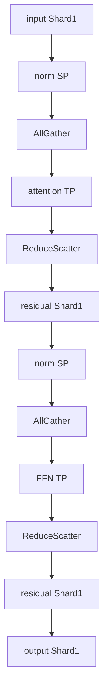

# `PrepareModuleInput` và transition giữa zone

Sequence Parallel chia một Transformer block thành hai zone: TP zone (bên trong attention/FFN) và SP zone (norm, residual). Mỗi lần đi từ zone này sang zone kia, tensor cần đổi placement, yêu cầu một collective. Chương này phân tích hai collective then chốt: **AllGather** (SP -> TP) và **ReduceScatter** (TP -> SP), và cách `PrepareModuleInput` đóng gói chúng.

## Sơ đồ một Transformer block với SP



Hai loại collective cần làm:

- **AllGather** trên chiều sequence: từ Shard(1) sang Replicate. Mỗi rank đóng góp shard sequence của mình, mọi rank nhận lại sequence đầy đủ.
- **ReduceScatter** trên chiều sequence: từ Partial sang Shard(1). Cộng partial từ mọi rank (như AllReduce) đồng thời chỉ giữ shard sequence của rank này (như Scatter).

## Tại sao AllGather + ReduceScatter chứ không AllReduce + Scatter

Trong TP cổ điển (không SP), ta dùng AllReduce ở cuối attention/FFN: cộng partial từ mọi rank, kết quả replicate trên mọi rank.

Trong SP, sau cộng ta chỉ cần shard sequence (Shard(1)), không cần replicate. Vậy có thể "kết hợp" AllReduce với Scatter thành ReduceScatter.

Lợi ích chính: ReduceScatter có **cùng** chi phí bandwidth như AllReduce (chiều ngược, NCCL implement bằng ring algorithm như AllReduce). Vì AllReduce = ReduceScatter + AllGather (theo ring algorithm), tách thành ReduceScatter + AllGather riêng lẻ cho phép ta đặt AllGather ở vị trí khác (đầu zone TP) thay vì cuối zone TP.

Tổng số "byte chuyển" trên toàn block:

- TP cổ điển: 2 AllReduce, mỗi cái byte chuyển $\approx 2 (P-1)/P \cdot \text{tensor size}$.
- SP: 2 ReduceScatter + 2 AllGather, mỗi cái byte chuyển $\approx (P-1)/P \cdot \text{tensor size}$.

Tổng: bằng nhau. SP không tăng giao tiếp.

Chú ý: vì AllReduce trên ring NCCL về implementation là ReduceScatter + AllGather, thực ra SP chỉ "tách" hai bước này ra. Lợi ích nằm ở chỗ giữa hai bước này, tensor nằm ở placement Shard, tiết kiệm activation memory.

## `PrepareModuleInput` chính thức

`PrepareModuleInput` là style đặc biệt: nó không shard parameter, nó chỉ chèn collective trên input của module wrapped để đưa input về placement mong muốn.

Cú pháp:

```python
PrepareModuleInput(
    input_layouts=(Shard(1), ...),       # placement hiện tại của input
    desired_input_layouts=(Replicate(), ...),  # placement cần đạt cho forward
    use_local_output=True,
)
```

Khi module wrapped được gọi:

1. PyTorch kiểm tra placement input.
2. Nếu khác `desired_input_layouts`, chèn collective phù hợp.
3. Gọi forward với input ở placement đúng.

Trong toy code:

```python
"attention": PrepareModuleInput(
    input_layouts=(Shard(1), None),
    desired_input_layouts=(Replicate(), None),
),
"feed_forward": PrepareModuleInput(
    input_layouts=(Shard(1),),
    desired_input_layouts=(Replicate(),),
),
```

Chú ý: PyTorch hiểu rằng đổi từ Shard(1) sang Replicate trên chiều sequence yêu cầu AllGather. PrepareModuleInput chèn AllGather này tự động.

`None` ở vị trí thứ hai trong tuple cho `attention` là cho `freqs_cis`, là buffer global không cần xử lý placement.

## ReduceScatter ở `RowwiseParallel(output_layouts=Shard(1))`

Phần đối ngẫu (TP -> SP, ReduceScatter) được đóng gói trong option `output_layouts` của `RowwiseParallel`:

```python
"attention.wo": RowwiseParallel(output_layouts=Shard(1)),
"feed_forward.w2": RowwiseParallel(output_layouts=Shard(1)),
```

Bình thường, RowwiseParallel kết thúc với output Replicate (sau AllReduce). Với option `output_layouts=Shard(1)`, output là Shard(1) (sau ReduceScatter).

Đây chính là phép biến đổi từ TP zone về SP zone.

## Backward đối ngẫu

Quy tắc đối ngẫu của Phần 1: forward AllGather kéo theo backward ReduceScatter, và ngược lại. Vì vậy:

- PrepareModuleInput forward = AllGather sequence, backward = ReduceScatter sequence.
- RowwiseParallel(Shard(1)) forward = ReduceScatter, backward = AllGather.

Tổng số collective backward = tổng số collective forward. Đối ngẫu sạch.

## Đếm collective một block với SP

Trong một block với SP, mỗi lần đi vào/ra TP zone:

- Vào attention: 1 AllGather (chiều sequence).
- Ra attention (qua `wo`): 1 ReduceScatter.
- Vào FFN: 1 AllGather.
- Ra FFN (qua `w2`): 1 ReduceScatter.

Tổng 4 collective forward, 4 backward = 8 collective/block. Mỗi collective trên tensor $(B, S, K)$ cùng kích thước với AllReduce của TP cổ điển. Cùng order chi phí.

So với TP cổ điển: 2 AllReduce forward + 2 backward = 4 collective. Có vẻ SP có nhiều collective hơn, nhưng phải nhớ AllReduce = ReduceScatter + AllGather về thực hiện vật lý trên NCCL ring. Nên SP **cùng** chi phí thực tế, chỉ là chia nhỏ ra hai bước.

## Tóm tắt zone và collective

| Vị trí | Placement input | Placement output | Collective |
|--------|------------------|-------------------|-------------|
| `attention_norm` | Shard(1) | Shard(1) | (không) |
| `attention` (qua PrepareModuleInput) | Shard(1) -> Replicate | local Replicate | AllGather |
| `wq, wk, wv` | Replicate | Shard(-1) | (không, local) |
| `attention` body | Shard(-1) head | Shard(-1) head | (không) |
| `wo` | Shard(-1) | Shard(1) | ReduceScatter |
| Residual + `ffn_norm` | Shard(1) | Shard(1) | (không) |
| Tương tự FFN | ... | ... | AllGather + ReduceScatter |

Chương tiếp: phân tích cost tổng cuối Phần 6.
